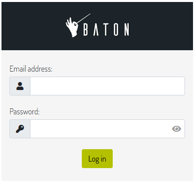
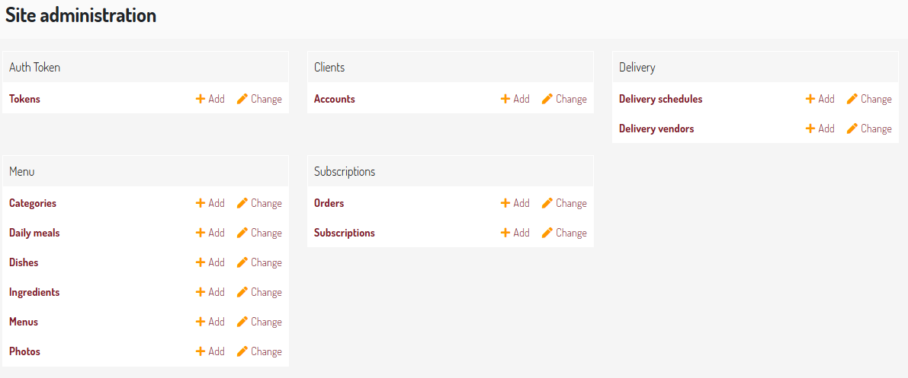

# Regular Meal CMS
### The content management system for a five-meals delivery subscription plans website. Ideal for a restaurant of healthy, medical and sports nutrition.

<p align="center">
   
</p>

# About
Regular Meal CMS contains only professional and reliable software technologies like Python Django, Django REST framework and JWT social authentication. Now you can forget about specifically and expensive website templates and hard to fix SQL errors! Furthermore, Regular Meal CMS provide localization and internationalization features.
* ###### PROJECT DEVELOPMENT STAGE: ALPHA VERSION
* ###### FULL TESTS COVERAGE FOR YOUR CONVENIENCE
* ###### READY-TO-USE RUSSIAN LANGUAGE SUPPORT

#### Business clients services:
* *Do you want to expand a range of the services that your restaurant provide?*
* *Do you want to open a new business with the health or sport five-meals nutrition delivery by monthly/weekly subscription plans?*

In both cases you can send [team leader](https://github.com/imgVOID) an E-Mail.


# Easy restaurant website setup
1. Clone the GitHub repo in a separate folder:
```
git clone https://github.com/EVOL-food/Regular-Meals-CMS.git
```
2. Go to the main directory of the project:
```
cd Regular-Meals-CMS
```
3. Install dependencies:
```
pip install -r requirements.txt
```
4. Create database migrations for each app:
```
python manage.py makemigrations menu
python manage.py makemigrations delivery
python manage.py makemigrations client
python manage.py makemigrations subscription
python manage.py makemigrations
```
5. Apply database migrations:
```
python manage.py migrate
```
6. Create first superuser (admin profile), remember your credentials:
```
python manage.py createsuperuser
```
7. Run server on the localhost:
```
python manage.py runserver
```
8. Now open an admin panel by visit URL `127.0.0.1:8000/en/admin/`. You will see this sign in page:
   
9. Enter your superuser credentials and press "Log in" button, so you will enter an admin area:
   
10. ### Congratulations, you've done with the CMS setup!
*Now you can create new dishes and menus, categories, delivery regimes and subscription types.*

# Requirements
Regular Meal CMS project has been written with the Python Django framework.

1. *Global*:  
  1.1. Django   
  1.2. Django REST Framework  

2. *Admin-panel*:  
  2.1. django-baton  
  2.2. django-admin-numeric-filter  
  2.3. django-filter  

3. *Internationalization and localization*:  
  3.1. django-modeltranslation  

4. *Django ORM Models*:  
  5.1. model_mommy  
  5.2. django-imagekit  

5. *Social authentication*:  
  5.1. djoser  
  5.2. social-auth-app-django  

6. *Extra*:  
  6.1. unidecode  
  6.2. markdown  
  6.3. coverage  
  6.4. pillow  

# TODOs
##### Backend:   
1. Make admin panel buttons for the language switching.
2. Connect image hosting API like Imgur or Cloudinary.
3. Make a celery task for the Order model, which will indicate the order status "Completed" after the subscription expires.
4. Make OAuth 2.0 better.
5. Make JWT Authentication better.
6. Meke REST API search for menus by: menu name (strict), names of dishes in the menu (non-strict, that is, contains).
7. Create docker image and docker setup instructions.
##### Frontend:   
1. Create a single page React application.
